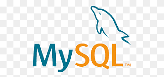

### Me, myself and I (call me Edu)

- 😄 Pronouns: He, him ♂
- 🔭 I'm currently working on a Django web application.
- 🌱 I'm currently learning Docker, Django, Kafka and Data Lakes.
- 👯 I'm looking to collaborate on blockchain tech in the future.
- 💬 Ask me about Data Engineering
- 📫 How to reach me: EduLF85#3366 on Discord.

- ⚡ Fun fact: I love craft beer.

---

Languages and Tools:

  
  
  
  
  
  <!--  -->
  

Find me on:

